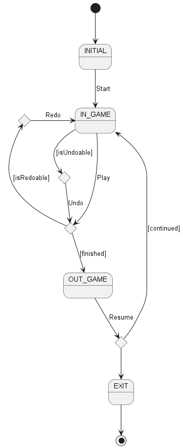
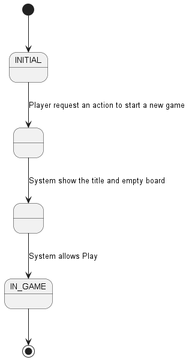
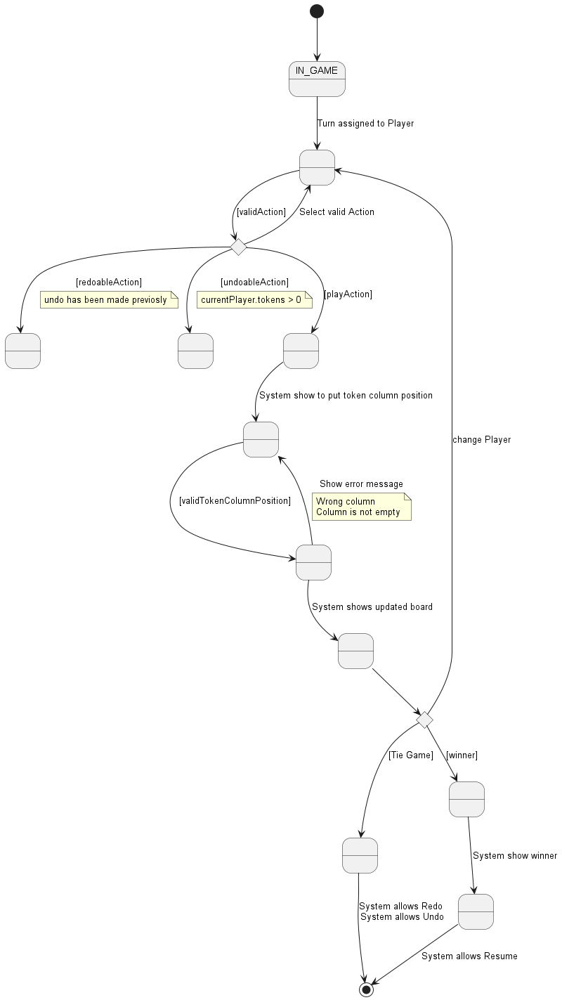
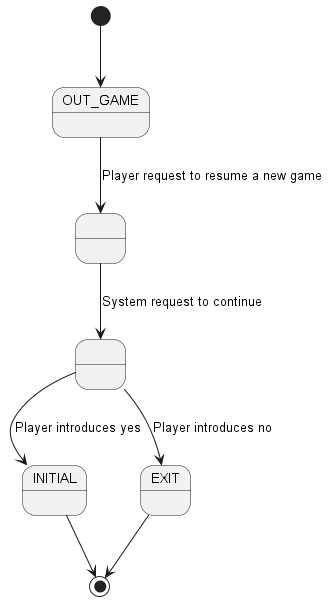

# Connecta4

More info [here](https://es.wikipedia.org/wiki/Conecta_4).


<table>
    <td>
        <ul>
                <li>Funcionalidad: Básica + Undo/Redo</li>
                <li>Interfaz: Gráfica y Texto</li>
                <li>Distribución: Standalone</li>
                <li>Persistencia: No</li>
        </ul>
</td>
    <td>
        
    </td>
</table>

### Vista de Casos de Uso


| **Diagrama de Actores y Casos de Uso**          |  **Diagrama de Contexto**   |
|-------------------------------------------------|-----|
| |  |


### Vista de Caso de Uso Start

 

### Vista de Caso de Uso Play

 


### Vista de Caso de Uso Resume
 


### Prototipo de Interfaz


**Consola**

```
#########CONNECT4#######
---------------
| * | * | * | * | * | * |
| * | * | * | * | * | * |
| * | * | * | * | * | * |
| * | * | * | * | * | * |
| * | * | * | * | * | * |
| * | * | * | * | * | * |
| * | * | * | * | * | * |

----- Choose one option -----
1) Do a action
1
player 1 turn 
Put token column position 1
---------------
 | * | * | * | * | * | * | 
 | * | * | * | * | * | * | 
 | * | * | * | * | * | * | 
 | * | * | * | * | * | * | 
 | * | * | * | * | * | * | 
 | * | * | * | * | * | * | 
 | B | * | * | * | * | * |
  
----- Choose one option -----
1) Do a action
2) Undo previous action  
1
player 2 turn 
Put token column position 1
---------------
 | * | * | * | * | * | * | 
 | * | * | * | * | * | * | 
 | * | * | * | * | * | * | 
 | * | * | * | * | * | * | 
 | * | * | * | * | * | * | 
 | R | * | * | * | * | * | 
 | B | * | * | * | * | * |
   
   
----- Choose one option -----
1) Do a action
2) Undo previous action    
2
---------------
 | * | * | * | * | * | * | 
 | * | * | * | * | * | * | 
 | * | * | * | * | * | * | 
 | * | * | * | * | * | * | 
 | * | * | * | * | * | * | 
 | * | * | * | * | * | * | 
 | * | * | * | * | * | * |
 
    
----- Choose one option -----
1) Do a action
2) Undo previous action
3) Redo previous action      
3
player 1 turn 
Put token column position 
---------------
 | * | * | * | * | * | * | 
 | * | * | * | * | * | * | 
 | * | * | * | * | * | * | 
 | * | * | * | * | * | * | 
 | * | * | * | * | * | * | 
 | * | * | * | * | * | * | 
 | * | * | * | * | * | * |
 
 
     
----- Choose one option -----
1) Do a action
2) Undo previous action
3) Redo previous action      
3
player 2 turn 
Put token column position 
1
---------------
 | * | * | * | * | * | * | 
 | * | * | * | * | * | * | 
 | * | * | * | * | * | * | 
 | B | * | * | * | * | * | 
 | B | R | * | * | * | * | 
 | B | R | * | * | * | * | 
 | B | R | * | * | * | * |
 
 2 player: You win!!! :-)
Reset game?? (y/n): 
```


## Autores

* [Jordy Piedra](https://github.com/JordyPiedra)
* [Jaime Vilca](https://github.com/jaimevilca)


